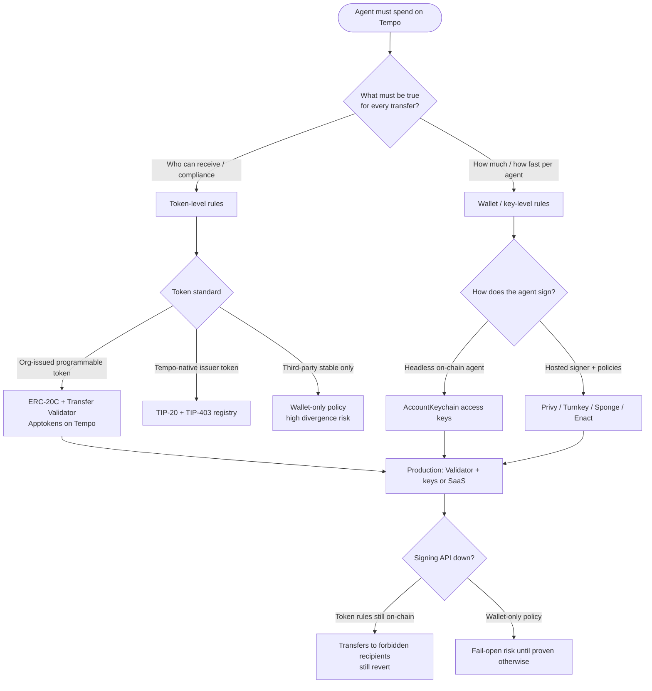
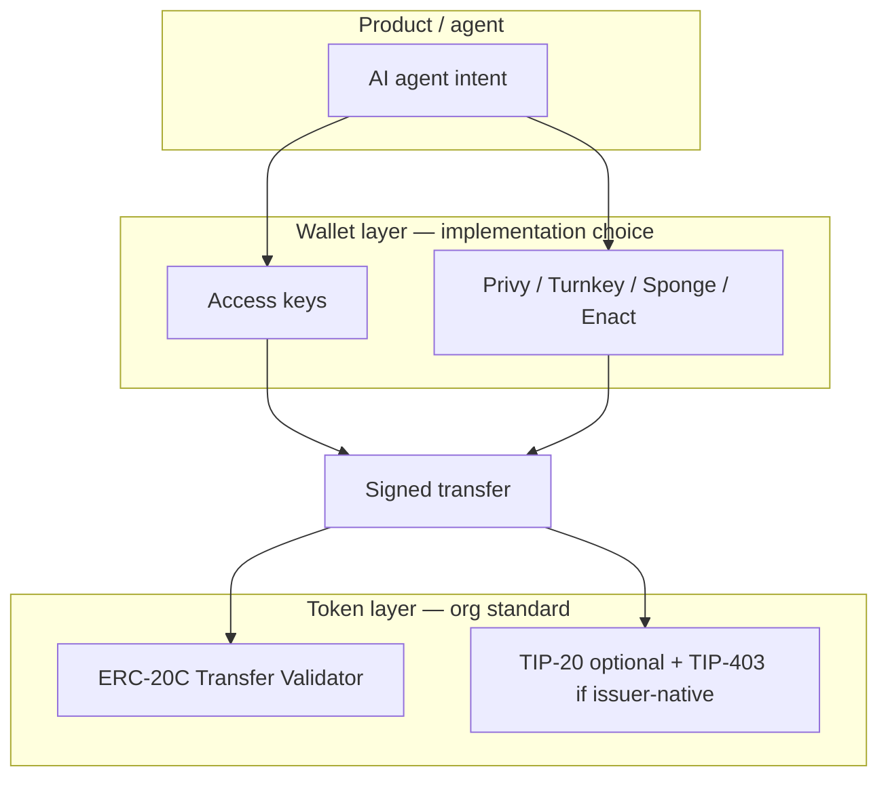

# Technology tradeoffs — agentic spend on Tempo

What we learned about **wallets**, **token types**, and **where to implement policy** while building agentic payment controls on Tempo.  
The [agentic wallet benchmark](README.md) was a forcing function; this doc is about the **technology**, not how to run the harness.

---

## Executive summary (leadership)

### The question

How should an AI agent spend money on Tempo such that policy survives bypass attempts — wrong recipients, limit evasion, and unsafe behavior when infrastructure fails?

### What we learned

| Insight | Takeaway |
|---------|----------|
| **Policy has layers** | **Token** (who may receive) · **agent/key** (how much, which calls) · **signer SaaS** (who may sign). They are not interchangeable. |
| **Wallets are not one category** | On-chain access keys and off-chain signing services enforce different shapes of rules; comparing them as “best wallet” without separating layers misleads. |
| **Token-level wins on destinations** | [Apptokens](https://apptokens.com/) (ERC-20C + Transfer Validator), which we deployed on Tempo, and Tempo [TIP-403](https://docs.tempo.xyz/protocol/tip403/spec) apply to **every** transfer regardless of who signs. |
| **Wallets win on agent budgets** | Rolling windows and per-transaction caps fit access keys and vendor policy engines; validators and TIP-403 are address-centric, not amount-velocity native. |
| **“Allowlist” is ambiguous** | Blocking evil via wallet often checks the wrong field (e.g. transaction `to` vs transfer recipient) or only the first hop in a contract forward — token validation closes that gap. |

### Recommendation

| Layer | Use for | Prefer |
|-------|---------|--------|
| **Compliance & payees** | Who can send/receive; block sanctioned or forbidden addresses; forward paths | **ERC-20C Transfer Validator** (org stack on Tempo) |
| **Agent budget** | Per-tx max, rolling spend, revoke agent | **AccountKeychain** and/or **managed wallet** policy |
| **Product & ops** | Dashboards, passkeys, fleet agents, HSM | **Privy / Turnkey / Sponge / Enact** as needed |

**One line:** Put **non-negotiable payment rules on the token**; use **wallets for how the agent signs and how fast it may spend** — do not expect any single wallet integration to be the whole policy system.

---

## Decision flow (architecture)

---

## Token types on Tempo (what each is for)

Do **not** confuse Tempo’s **`0x20C…` address prefix** (TIP-20 placement) with **ERC-20C Apptokens** ([Creator Token Standards](https://apptokens.com/)).

| Type | What it is | Policy model | Best for |
|------|------------|--------------|----------|
| **Plain ERC-20** | Standard contract on Tempo | None at protocol; app-only | Legacy assets, no compliance hook |
| **TIP-20** | Tempo native payment token ([spec](https://docs.tempo.xyz/protocol/tip20/spec)); pathUSD is the canonical example | Optional [TIP-403](https://docs.tempo.xyz/protocol/tip403/spec) `transferPolicyId` — whitelist/blacklist via shared registry | Tempo-native issuance, fees, memos, DEX integration |
| **ERC-20C (Apptokens)** | ERC-20 + **Transfer Validator** enforced on every transfer | Modular onchain rulesets: whitelist/blacklist/freeze, operators, venues | **Programmable money with opinions** — rules follow the token everywhere |

### TIP-403 (Tempo native token policy)

- Registry at `0x403c…`; token admin assigns policy to a TIP-20.
- Every transfer checks **sender and recipient** against whitelist or blacklist.
- **Strength:** One policy update can apply to many TIP-20s; native to Tempo stablecoin stack.
- **Limit:** Address-centric — not a substitute for per-tx amount or rolling velocity (those stay at wallet/key layer).

### Apptokens / ERC-20C (org implementation on Tempo)

- [Transfer Validator V5](https://apptokens.com/) runs **before** transfer completes — “tokens with opinions.”
- **Strength:** Same compliance story across apps, aggregators, and contract-mediated flows (e.g. pull + forward) if rulesets cover recipients and operators.
- **Limit:** Amount/time velocity is not the primary primitive; design rulesets for **who/where**, wallets for **how much/how often**.
- **Org status:** Core contracts **implemented on Tempo** — token-level ideas are production-ready; integration work is rules + product wiring, not reinventing the standard.

### When to use which token layer

| Need | ERC-20C validator | TIP-403 |
|------|-------------------|---------|
| Block forbidden recipients (incl. contract forwards) | Primary | Strong |
| Shared compliance across many token contracts | Ruleset + validator deployment | Single registry, multiple TIP-20s |
| Tempo pathUSD / system stables only | Only if validator wired to that asset | If you control token admin |
| Venue / operator restrictions | Validator strength | Limited to address lists |

---

## Wallet types (what we learned)

Wallets here means **how the agent’s key signs** — not the token standard.

| Category | Examples | Where policy lives | Survives signer API outage? |
|----------|----------|-------------------|----------------------------|
| **Protocol access keys** | Tempo access keys, Enact (session key + root) | AccountKeychain: rolling **spend limit per token**, optional **call scopes** (which contract, which selector, which recipients on TIP-20 transfers) | **Yes** — limits and scopes are on-chain |
| **Off-chain signing** | Privy, Turnkey, Sponge | Vendor policy engine **before** sign; APIs for allowlist, daily limits, agent fleet | **Only if** unsigned txs cannot execute — must be designed and tested |

### Protocol access keys — learnings

| Capability | Observation |
|------------|-------------|
| **Rolling spend window** | Works as modeled — cumulative cap over a period is a good fit for “agent budget.” |
| **Per-transaction cap** | **Not a separate on-chain knob** — one limit per token; “$10 per tx” must be enforced elsewhere or approximated by window + tx sizing. |
| **Destination allowlist** | Requires **call scopes**; limits-only authorization does **not** block paying forbidden addresses. |
| **Call scopes on Moderato** | Scoped TIP-20 transfers have had **compatibility friction** — destination policy is powerful but operationally sensitive (gas, reverts). |
| **Forward / intermediary** | Scopes on “call Intermediary” do not equal “final payee must be allowlisted” — **token validator** or recipient checks on the inner `transfer` matter. |
| **Revocation** | On-chain key revoke is **fast and definitive** for that agent identity. |

### Off-chain signing — learnings

| Capability | Observation |
|------------|-------------|
| **Per-tx amount** | Natural fit in policy DSL (`amount <= X`) — **easier than protocol** for simple caps. |
| **Rolling window** | **Easy to under-implement** — mapping “$25 per 5 minutes” to “daily limit” or omitting window rules entirely breaks velocity semantics. |
| **Allowlist** | Often tied to **transaction `to`**, not TIP-20 **transfer recipient** — agent may call token contract while paying EVIL in calldata; **false sense of security**. |
| **Intermediary / contract calls** | Blocking `to = Intermediary` is different from blocking **EVIL as final recipient** — token layer or explicit contract-call rules required. |
| **Fail-open** | Architectural class: if policy and signing share one service, **outage behavior must be proven** (deny sign, not silent allow). |
| **Revocation** | Policy delete or zero limit — effective if enforced at sign time; semantics differ from key revoke. |
| **Ops** | Dashboards, API keys, master keys for fleet/agents — **product velocity** at cost of **trust boundary** on vendor. |

### Wallet comparison is only meaningful per concern

| Concern | Strongest typical fit |
|---------|------------------------|
| No vendor for policy persistence | Protocol access keys |
| Fastest policy iteration in SaaS | Privy, Turnkey |
| Agent fleet + platform limits | Sponge |
| Passkey / human root + agent session | Enact (still protocol underneath) |
| Per-tx cap without custom token rules | Off-chain signing |
| Rolling agent budget on-chain | Protocol access keys |
| “Never pay this address” all signers | **Token validator or TIP-403** — not wallet alone |

---

## Implementation tradeoffs (where code and risk live)

| Decision | Token (ERC-20C / TIP-403) | Protocol keys | Off-chain wallet |
|----------|---------------------------|---------------|------------------|
| **Who builds the rules** | Your rulesets / registry admin | viem `accessKey.authorize` | Vendor policy JSON / API |
| **Who can bypass with a different signer** | No — rule is on asset | Only if new key without limits | Only if another wallet ungoverned |
| **Contract forward to forbidden payee** | Block at inner transfer if recipient checked | Often **misses** | Depends on `to` vs calldata |
| **Amount velocity** | Custom / off-chain indexer | Rolling limit per token | Policy + platform limits |
| **Per-tx max** | Non-native | Non-native on-chain | Native in several vendors |
| **Compliance updates** | Update ruleset / registry | Re-authorize key | Update API policy |
| **Audit surface** | Validator + token | AccountKeychain + Tempo precompiles | Vendor + your adapter |
| **Testnet evidence** | Deploy + rules (org done) | Observed: window OK, destinations weak without scopes | Integrations vary; field semantics matter |

### Build vs integrate (effort shape, not harness tasks)

| Work | Relative effort | Notes |
|------|-----------------|-------|
| Deploy ERC-20C + validator on Tempo | **Done (org)** | Standards from [Apptokens](https://apptokens.com/) |
| Define production rulesets (payees, evil, operators, venues) | **Medium** | Product/legal input → onchain config |
| Wire agent products to spend ERC-20C | **Medium** | Same ERC-20 surface; ensure tools call `transfer` path validator sees |
| AccountKeychain agent budgets | **Low–medium** | viem tempo; scopes need Moderato hardening |
| Privy / Turnkey policies with **recipient-aware** Tempo rules | **Medium** | Calldata / `tempo.tx.*` / method-specific rules |
| Dual TIP-20 pathUSD + ERC-20C | **Medium** | Two assets, two policy stories — avoid unless required |
| Wallet-only policy on third-party pathUSD | **Low upfront, high risk** | What exploration showed: **destination policy diverges** per integration |

---

## Layered architecture (what we would ship)

| Layer | Responsibility | Failure mode to avoid |
|-------|----------------|----------------------|
| **Token** | Authorized participants, forbidden addresses, operator/venue rules | Paying EVIL via approved contract forward |
| **Wallet** | Signer governance, per-tx cap, rolling budget, revoke agent | Policy API down but sign still allowed |
| **App** | Intent, audit logs, human approval | Assuming wallet “allowlist” equals payee allowlist |

---

## Lessons from exploration (evidence, not the subject)

Running the same adversary scenarios against multiple signers while spending **unrestricted pathUSD** surfaced the table above. One illustrative protocol run: **rolling window enforced**, **forbidden-destination attempts did not revert under limits-only key authorization** — consistent with “wallet layer without token layer is incomplete.”

That does **not** mean one wallet “scored 25%” and another wins. It means **destination policy belongs on the token** (your ERC-20C stack), and **velocity policy belongs on the agent wallet** — then pick wallets for signing UX, custody, and ops.

---

## Anti-patterns (from this process)

| Anti-pattern | Why it fails |
|--------------|--------------|
| Picking a wallet vendor based on a single blended “policy score” | Different layers measured different things |
| Equating Tempo `0x20C` addresses with ERC-20C Apptokens | Different standards entirely |
| Allowlist = `eth_sendTransaction.to` on TIP-20 transfers | Recipient is inside token call, not outer `to` |
| Only scoping “may call Intermediary” | Forward may still pay forbidden final address |
| Expecting access keys to enforce per-tx and rolling window separately | One limit per token on-chain |
| Skipping token rules because “we have Privy policies” | New signer or field bug bypasses SaaS-only control |

---

## Further reading

| Topic | Link |
|-------|------|
| Apptokens / ERC-20C / Transfer Validator | https://apptokens.com/ |
| TIP-403 | https://docs.tempo.xyz/protocol/tip403/spec |
| TIP-20 | https://docs.tempo.xyz/protocol/tip20/spec |
| AccountKeychain call scopes | https://github.com/tempoxyz/tempo/blob/main/tips/tip-1011.md |
| Benchmark methodology (reference only) | [`METHODOLOGY.md`](METHODOLOGY.md) |
